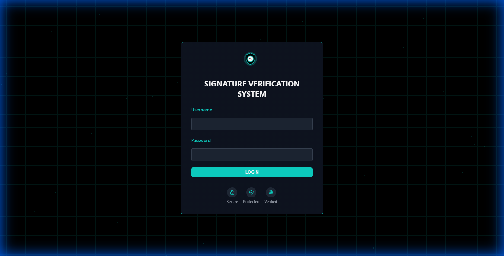
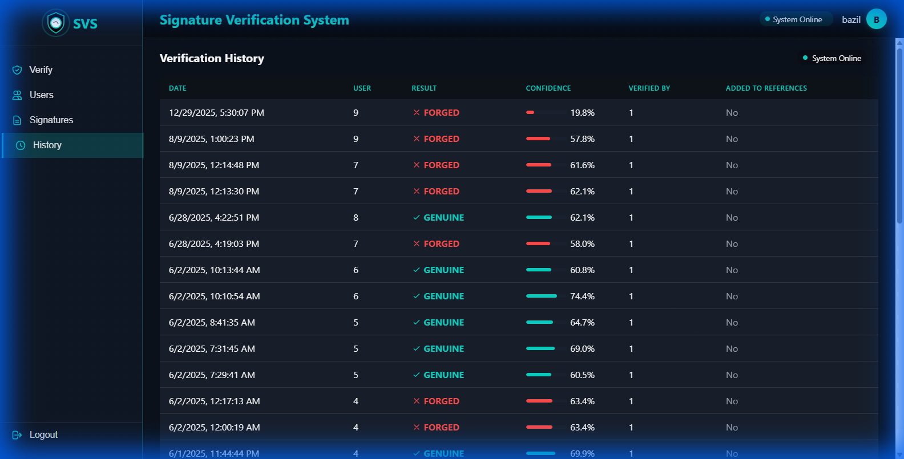
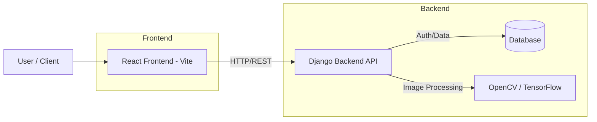

# Signature Verification System - Frontend

A state-of-the-art React-based frontend for the Signature Verification System. This application enables secure user authentication, real-time signature capture via camera or upload, and advanced verification against stored profiles using backend image processing.

### Screenshots
| Login Page | Dashboard / History |
|:---:|:---:|
|  |  |

## Features

- **User Authentication**: Secure Login and Registration pages.
- **Dashboard**: Centralized view for managing signature activities.
- **Signature Capture**: 
    - **Camera Capture**: Real-time signature capture using device camera.
    - **Interactive Upload**: Drag-and-drop support for signature images.
- **Signature Management**: View, delete, and organize stored signatures.
- **Verification**: Form interface to submit signatures for verification against stored profiles.
- **Feedback**: Dynamic animations and loading states for better user experience.

## Architecture



## Tech Interface

- **Framework**: React 18
- **Build Tool**: Vite
- **Styling**: CSS Modules / Custom CSS
- **State Management**: React Hooks
- **HTTP Client**: Axios (implied) / Fetch

## Getting Started

### Prerequisites
- Node.js (v16+)
- npm or yarn

### Installation

1.  Clone the repository:
    ```bash
    git clone https://github.com/yourusername/signature-verification-frontend.git
    cd signature-verification-frontend
    ```

2.  Install dependencies:
    ```bash
    npm install
    ```

3.  Run the development server:
    ```bash
    npm run dev
    ```

4.  Open [http://localhost:5173](http://localhost:5173) to view it in the browser.

## Project Structure

```
src/
├── assets/          # Static assets
├── components/      # Reusable UI components
├── pages/           # Page components (Login, Register, Dashboard)
├── helpers/         # Utility functions (ImageProcessor)
└── api.js           # API configuration
```

## License

[MIT](LICENSE)
