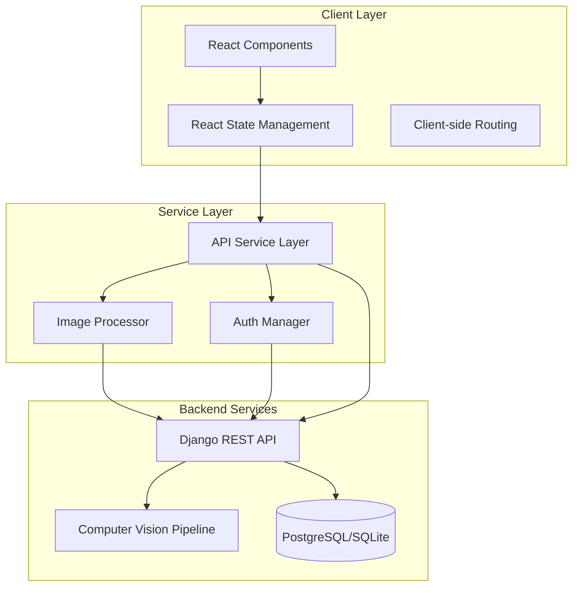

# Signature Verification System - Frontend

A production-ready React application for biometric signature verification and authentication. Built with modern web technologies, this system provides real-time signature capture, client-side image preprocessing, and seamless integration with a Django REST backend for advanced signature analysis using computer vision algorithms.

## Screenshots

| Login Page | Dashboard / History |
|:---:|:---:|
|  |  |

## Core Features

### Authentication & User Management
- Token-based authentication with JWT-style tokens
- Secure session management with automatic token expiration handling
- Protected routes and API request interceptors
- Registration with validation and error feedback

### Signature Acquisition
- **Real-time Camera Capture**: Browser-based MediaStream API integration for live signature capture
- **Interactive Upload Interface**: Drag-and-drop file upload with preview functionality
- **Image Preprocessing**: Client-side image enhancement pipeline including grayscale conversion, brightness/contrast adjustment, and noise reduction
- **Multi-format Support**: JPEG, PNG, and other standard image formats

### Signature Management
- Profile-based signature organization
- CRUD operations for user profiles and signatures
- Signature history with timestamps and metadata
- Bulk delete and management operations

### Verification Engine Integration
- Real-time verification requests to Django backend
- Detailed verification results with confidence scores
- Verification history tracking with persistent storage
- Option to add verified signatures to reference database

### User Interface
- Responsive Material Design-inspired interface
- Loading animations and skeleton screens
- Real-time feedback with success/error states
- Modal-based workflows for signature operations
- Enhanced dashboard with data visualization

## Technical Architecture

### System Overview



### Technology Stack

#### Core Framework
- **React 18.2.0**: Leveraging concurrent rendering and automatic batching
- **Vite 4.4.5**: Next-generation frontend build tool with HMR and optimized bundling
- **ES Modules**: Native ESM support for faster development

#### Development Tools
- **ESLint 8.45.0**: Code quality and consistency enforcement
- **React Plugin Suite**: react-hooks, react-refresh plugins for optimal DX
- **Vite React Plugin**: Fast Refresh support with automatic JSX runtime

#### Build Configuration
- **Hot Module Replacement (HMR)**: Instant feedback during development
- **Code Splitting**: Automatic chunk splitting for optimized loading
- **Tree Shaking**: Dead code elimination in production builds
- **Asset Optimization**: Image and CSS optimization pipeline

### Frontend Architecture

#### Component Hierarchy
```
App (Root Component)
├── LoginPage
│   └── Form Components
├── RegisterPage
│   └── Form Components
└── Dashboard (Protected Route)
    ├── EnhancedDashboardUI
    │   ├── Profile Management
    │   ├── Statistics Overview
    │   └── Quick Actions
    ├── CameraCapture
    │   ├── MediaStream API Integration
    │   └── Canvas-based Processing
    ├── InteractiveSignatureUpload
    │   ├── Drag-and-Drop Handler
    │   └── File Preview
    ├── VerifySignatureForm
    │   ├── Profile Selector
    │   └── Results Display
    ├── ManageSignatures
    │   ├── Signature Grid
    │   └── Bulk Operations
    └── FeedbackAnimations
        ├── Loading States
        └── Success/Error Animations
```

#### State Management Strategy
- **Component-level State**: React Hooks (useState, useEffect, useReducer)
- **Context API**: Global authentication state
- **Local Storage**: Persistent token and user preferences
- **Optimistic Updates**: Immediate UI feedback with background sync

### API Integration Layer

#### Service Architecture
The application uses a modular API service layer (`api.js`) with the following components:

**Authentication Service**
- Token-based authentication using Django REST framework tokens
- Automatic token attachment to authenticated requests
- Token expiration handling with automatic redirect
- Logout with server-side session invalidation

**Profiles API**
```javascript
GET    /api/profiles/              // List all profiles
GET    /api/profiles/:id/          // Get profile details
POST   /api/profiles/              // Create new profile
PUT    /api/profiles/:id/          // Update profile
DELETE /api/profiles/:id/          // Delete profile
GET    /api/profiles/:id/signatures/    // Get profile signatures
GET    /api/profiles/:id/verifications/ // Get verification history
```

**Signatures API**
```javascript
GET    /api/signatures/            // List all signatures
GET    /api/signatures/:id/        // Get signature details
POST   /api/signatures/            // Upload new signature (multipart/form-data)
DELETE /api/signatures/:id/        // Delete signature
```

**Verification API**
```javascript
POST   /api/verify/                // Submit verification request
GET    /api/verification-records/  // Get verification history
GET    /api/verification-records/:id/     // Get specific record
POST   /api/verification-records/:id/add_to_references/ // Add to reference set
```

#### Request Handling Features
- **Automatic Content-Type Management**: JSON and FormData handling
- **CORS Configuration**: Credential inclusion for cross-origin requests
- **Error Normalization**: Consistent error format across all API calls
- **Request Logging**: Comprehensive console logging for debugging
- **Response Parsing**: Robust JSON parsing with fallback handling

### Image Processing Pipeline

The client-side image processor (`ImageProcessor.js`) implements computer vision algorithms in JavaScript:

#### Processing Stages
1. **Grayscale Conversion**: RGB to luminance transformation
2. **Brightness/Contrast Adjustment**: Adaptive histogram equalization
3. **Noise Reduction**: Gaussian blur approximation using CSS filters
4. **Edge Detection**: Sobel operator implementation for contour detection

#### Technical Implementation
```javascript
// Canvas-based processing pipeline
enhanceDocumentImage(canvas) {
  1. Clone canvas to processing buffer
  2. Apply grayscale transformation (per-pixel RGB averaging)
  3. Adjust brightness (+30) and contrast (1.2x)
  4. Apply Gaussian blur (radius: 1px) for noise reduction
  5. Export as PNG DataURL
}
```

#### Performance Characteristics
- **In-memory Processing**: No server round-trip for preprocessing
- **Canvas API Acceleration**: Hardware-accelerated where available
- **Worker-ready**: Architecture supports Web Worker offloading
- **Progressive Enhancement**: Fallback for browsers without canvas support

## Installation & Setup

### Prerequisites
- Node.js >= 16.0.0
- npm >= 7.0.0 or yarn >= 1.22.0
- Modern browser with ES2015+ support

### Quick Start

1. Clone the repository:
```bash
git clone <repository-url>
cd SVS_react
```

2. Install dependencies:
```bash
npm install
```

3. Configure API endpoint (if different from default):
```javascript
// src/api.js
const API_BASE_URL = 'http://127.0.0.1:8000/api';
```

4. Start development server:
```bash
npm run dev
```

The application will be available at `http://localhost:5173`

### Build for Production

```bash
# Create optimized production build
npm run build

# Preview production build locally
npm run preview
```

Build artifacts will be generated in the `dist/` directory.

### Code Quality

```bash
# Run ESLint
npm run lint

# Fix auto-fixable issues
npm run lint -- --fix
```

## Project Structure

```
SVS_react/
├── src/
│   ├── api.js                          # API service layer and HTTP client
│   ├── ImageProcessor.js               # Client-side image processing utilities
│   ├── App.jsx                         # Root component and routing
│   ├── main.jsx                        # Application entry point
│   │
│   ├── Authentication/
│   │   ├── LoginPage.jsx               # Login form and authentication
│   │   ├── LoginPage.css
│   │   ├── RegisterPage.jsx            # User registration
│   │   └── RegisterPage.css
│   │
│   ├── Dashboard/
│   │   ├── Dashboard.jsx               # Main dashboard container
│   │   ├── Dashboard.css
│   │   ├── EnhancedDashboardUI.jsx     # Enhanced UI with statistics
│   │   └── EnhancedUserProfileSelector.jsx
│   │
│   ├── Signature Capture/
│   │   ├── CameraCapture.jsx           # Real-time camera capture
│   │   ├── CameraCapture.css
│   │   ├── SignatureCapture.jsx        # Base capture component
│   │   ├── SignatureCaptureModal.jsx   # Modal wrapper
│   │   └── InteractiveSignatureUpload.jsx  # Drag-and-drop upload
│   │
│   ├── Signature Management/
│   │   ├── ManageSignatures.jsx        # Signature CRUD operations
│   │   └── VerifySignatureForm.jsx     # Verification submission
│   │
│   ├── UI Components/
│   │   ├── FeedbackAnimations.jsx      # Loading and feedback animations
│   │   └── SignatureLoadingAnimation.jsx
│   │
│   ├── assets/                         # Static assets (images, icons)
│   └── styles/
│       ├── App.css                     # Global styles
│       ├── index.css                   # Base styles
│       └── reset.css                   # CSS reset
│
├── public/                             # Public static files
├── dist/                               # Production build output
├── vite.config.js                      # Vite configuration
├── eslint.config.js                    # ESLint configuration
├── package.json                        # Project dependencies and scripts
└── README.md
```

## Key Components

### Dashboard.jsx
Main application container that manages:
- User profile state and CRUD operations
- Signature management workflows
- Navigation between different views
- Global loading and error states

### CameraCapture.jsx
Implements real-time signature capture:
- MediaStream API integration for camera access
- Canvas-based frame capture and processing
- Image enhancement before submission
- Camera permission handling

### VerifySignatureForm.jsx
Handles verification workflow:
- Profile selection interface
- Test signature upload
- Verification request submission
- Results display with confidence scores
- Option to save verified signatures

### ImageProcessor.js
Client-side image processing module:
- **Grayscale Conversion**: Reduces color complexity
- **Brightness/Contrast**: Improves ink-to-paper contrast
- **Noise Reduction**: Removes artifacts and noise
- **Edge Detection**: Sobel operator for contour analysis

### api.js
Centralized API service layer:
- Request/response interceptors
- Token management
- Error handling and normalization
- FormData and JSON request handling

## Backend Integration

### Authentication Flow
1. User submits credentials via LoginPage
2. Frontend sends POST to `/api/auth/token/`
3. Backend validates and returns authentication token
4. Token stored in localStorage
5. Token attached to all subsequent API requests via Authorization header
6. 401 responses trigger automatic logout and redirect

### Verification Flow
1. User selects profile and uploads test signature
2. Client-side preprocessing enhances image quality
3. FormData POST to `/api/verify/` with:
   - user_profile_id
   - test_signature (File object)
   - save_to_references (boolean)
   - notes (optional string)
4. Backend processes with OpenCV/TensorFlow
5. Returns verification result with confidence score
6. Frontend displays result and updates history

### Data Models

**UserProfile**
```json
{
  "id": "integer",
  "user": "integer (FK)",
  "full_name": "string",
  "created_at": "datetime",
  "updated_at": "datetime"
}
```

**Signature**
```json
{
  "id": "integer",
  "user_profile": "integer (FK)",
  "image": "string (URL)",
  "uploaded_at": "datetime",
  "notes": "string (optional)"
}
```

**VerificationRecord**
```json
{
  "id": "integer",
  "user_profile": "integer (FK)",
  "test_signature": "string (URL)",
  "result": "boolean",
  "confidence_score": "float",
  "verified_at": "datetime",
  "notes": "string (optional)"
}
```

## Performance Optimizations

### Build Optimizations
- **Code Splitting**: Automatic route-based splitting
- **Lazy Loading**: Dynamic imports for heavy components
- **Asset Optimization**: Image compression and format conversion
- **Tree Shaking**: Eliminates unused code from bundles

### Runtime Optimizations
- **React.memo**: Prevents unnecessary re-renders
- **useCallback/useMemo**: Memoization for expensive operations
- **Debouncing**: Input debouncing for search and filters
- **Image Lazy Loading**: Defer offscreen image loading

### Network Optimizations
- **Request Batching**: Combine related API calls
- **Caching**: localStorage for frequently accessed data
- **Compression**: Gzip/Brotli for text assets
- **CDN Ready**: Static assets can be served from CDN

## Browser Compatibility

- Chrome/Edge >= 90
- Firefox >= 88
- Safari >= 14
- Opera >= 76

**Required Browser APIs:**
- ES2015+ (Arrow functions, Promises, Classes)
- Fetch API
- MediaStream API (for camera capture)
- Canvas API (for image processing)
- LocalStorage API (for token persistence)

## Security Considerations

### Authentication
- Token-based authentication with secure storage
- Automatic token expiration handling
- CSRF protection via Django backend
- Secure HTTP-only cookie option available

### Data Privacy
- No sensitive data in localStorage beyond auth token
- HTTPS enforced in production
- Signature images transmitted over encrypted connections
- No client-side persistence of signature data

### Input Validation
- File type validation (image formats only)
- File size restrictions
- Form input sanitization
- XSS prevention through React's built-in escaping

## Development Workflow

### Local Development
1. Start backend server (Django): `python manage.py runserver`
2. Start frontend dev server: `npm run dev`
3. Access application at `http://localhost:5173`
4. Hot reload enabled for instant feedback

### Testing
- Unit tests: Component-level testing
- Integration tests: API service testing
- E2E tests: Full workflow validation

### Deployment
1. Build production bundle: `npm run build`
2. Deploy `dist/` directory to static hosting
3. Configure API_BASE_URL for production backend
4. Set up environment variables for sensitive configs

## Future Enhancements

- **Progressive Web App (PWA)**: Offline support and installability
- **WebAssembly**: Port image processing to WASM for better performance
- **Real-time Collaboration**: WebSocket support for live verification
- **Advanced Analytics**: Detailed verification statistics and insights
- **Multi-language Support**: i18n implementation
- **Accessibility**: WCAG 2.1 AA compliance
- **Mobile Apps**: React Native versions for iOS/Android

## License

MIT License - see LICENSE file for details

## Support & Documentation

For technical documentation, API references, and troubleshooting guides, please refer to the backend Django application documentation.

For issues, feature requests, or contributions, please use the project's issue tracker.
